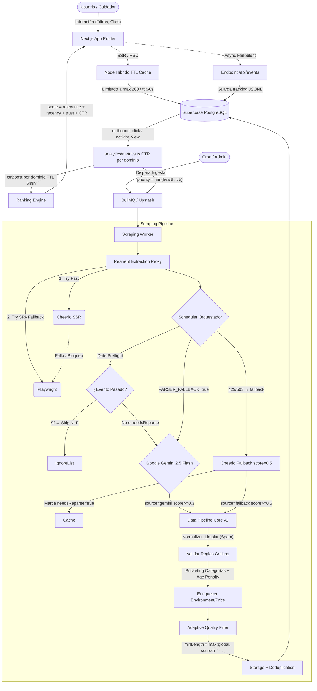

# HabitaPlan — Arquitectura del Sistema

> Versión: v0.14.1 | Actualizado: 2026-04-22
> Documento vivo — se actualiza con cada versión mayor.

---

## 1. Visión General

**HabitaPlan** es un agregador multi-fuente de actividades para niños y familias en Bogotá (con visión de expansión a otras ciudades de Colombia y Latinoamérica). Resuelve el problema de la información fragmentada: talleres, eventos, clubes y cursos están dispersos entre sitios web institucionales, redes sociales, grupos de mensajería y academias privadas.

**Problema central:** Los padres y cuidadores pierden tiempo buscando en múltiples fuentes sin garantía de que la información esté actualizada.

**Solución:** Motor de scraping multi-fuente con NLP (Gemini 2.5 Flash) que normaliza, deduplica y clasifica actividades en una plataforma unificada.

### Diagrama de Arquitectura Global



---

## 2. Stack Tecnológico

| Capa | Tecnología | Versión | Notas |
|---|---|---|---|
| Framework web | Next.js (App Router) | 16.2.1 | SSR + RSC |
| Lenguaje | TypeScript | ^5 | Strict mode |
| UI | Tailwind CSS | v4 | Sin componentes externos |
| Base de datos | PostgreSQL (Supabase) | — | Hosted en AWS |
| ORM | Prisma | 7.5.0 | Adapter `@prisma/adapter-pg` |
| Autenticación | Supabase Auth | ^2.99 | JWT + SSR cookies |
| NLP / IA | Gemini 2.5 Flash | ^0.24.1 | Via `@google/generative-ai` |
| Scraping estático | Cheerio | ^1.2.0 | Sitios con SSR/HTML estático |
| Scraping dinámico | Playwright | ^1.58.2 | Instagram y SPAs |
| Email | Resend + react-email | ^6.9.4 | Transaccional |
| Validación | Zod | ^4.3.6 | Schemas runtime |
| Tests | Vitest | ^4.1.0 | + @vitest/coverage-v8 |
| Cola | BullMQ + Upstash Redis | — | Jobs de scraping asincrono |
| Geocoding | venue-dictionary.ts + Nominatim | — | 40+ venues Bogota ~0ms, sin API key |
| Proxy | IPRoyal (opcional) | — | IPs residenciales para Instagram/TikTok |
| Despliegue | Vercel | — | Crons integrados |
| CI/CD | GitHub → Vercel | — | Auto-deploy en push a master |

> **NLP:** El motor activo es **Gemini 2.5 Flash** (Google AI Studio). Existe `claude.analyzer.ts` como alternativa futura con la API de Anthropic, pero no está en uso en producción.

---

## 3. Estructura de Directorios

```
habitaplan/
├── src/
│   ├── app/                        # Next.js App Router
│   │   ├── page.tsx                # Home — hero + buscador + categorías + recientes (S37)
│   │   ├── _components/
│   │   │   └── HeroSearch.tsx      # Client Component: buscador mixto (actividades+cats+ciudades), cache, AbortController, historial (S40)
│   │   ├── actividades/            # Listado con filtros facetados
│   │   ├── login/                  # Autenticación (Supabase Auth — redirige a /onboarding si nuevo)
│   │   ├── registro/               # Registro con email de bienvenida
│   │   ├── onboarding/             # Wizard 3 pasos: Ciudad → Hijos → Listo (NUEVO v0.9.1)
│   │   ├── perfil/                 # Perfil de usuario, hijos, favoritos, notificaciones, historial
│   │   ├── admin/                  # Panel interno (logs de scraping, fuentes, claims)
│   │   │   └── claims/             # Lista y gestión de solicitudes de reclamación (NUEVO v0.9.1)
│   │   ├── proveedores/
│   │   │   └── [slug]/
│   │   │       └── reclamar/       # Formulario de reclamación de provider (NUEVO v0.9.1)
│   │   ├── contacto/               # Formulario de contacto
│   │   ├── contribuir/             # Página para proveedores
│   │   ├── privacidad/             # Política de privacidad
│   │   ├── terminos/               # Términos de uso
│   │   ├── tratamiento-datos/      # Aviso de tratamiento (Ley 1581)
│   │   └── api/
│   │       ├── activities/         # CRUD de actividades
│   │       │   └── [id]/
│   │       │       └── ratings/    # Calificaciones por actividad
│   │       ├── favorites/          # Favoritos del usuario
│   │       │   └── [activityId]/
│   │       ├── ratings/            # Calificaciones globales (recalc ratingAvg en provider)
│   │       │   └── [activityId]/
│   │       ├── children/           # Hijos/perfiles de menores
│   │       │   └── [id]/
│   │       ├── cities/             # Lista de ciudades para onboarding (NUEVO v0.9.1)
│   │       ├── providers/
│   │       │   └── [slug]/
│   │       │       └── claim/      # POST — solicitud de reclamación de provider (NUEVO v0.9.1)
│   │       ├── profile/            # Perfil del usuario autenticado
│   │       │   ├── avatar/
│   │       │   ├── me/             # GET — id, name, cityId, onboardingDone (NUEVO v0.9.1)
│   │       │   ├── onboarding/     # PATCH — guarda cityId + onboardingDone=true (NUEVO v0.9.1)
│   │       │   └── notifications/
│   │       ├── auth/
│   │       │   └── send-welcome/   # Email de bienvenida post-registro
│   │       ├── health/                    # Health check DB + Redis — timeouts 2000ms, ok/degraded/down, by_city (S48)
│   │       └── admin/                     # Protegidas por middleware.ts (ADMIN o CRON_SECRET)
│   │           ├── cron/
│   │           │   └── scrape/           # Scheduler automático de scraping (cron */6h) — CRON_SECRET
│   │           ├── expire-activities/     # Marcar actividades vencidas (cron 5AM UTC)
│   │           ├── send-notifications/    # Envío masivo de notificaciones (cron 9AM UTC)
│   │           ├── sponsors/              # CRUD de sponsors newsletter
│   │           │   └── [id]/             # PATCH / DELETE por id
│   │           ├── claims/                # Gestión de solicitudes de reclamación (NUEVO v0.9.1)
│   │           │   └── [id]/             # PATCH approve / reject
│   │           ├── queue/                 # Estado y encolado de jobs BullMQ
│   │           ├── analytics/             # Endpoint POST para ingestar eventos de Product Analytics (page_view, clics)
│   │           ├── quality/               # Content Quality Dashboard — UI/UX Métricas de ingesta (NUEVO v0.10.0)
│   │           └── scraping/
│   │               ├── sources/           # CRUD de fuentes de scraping
│   │               └── logs/              # Historial de ejecuciones
│   │
│   ├── modules/                    # Lógica de negocio por dominio
│   │   ├── activities/             # Servicio + schemas de actividades
│   │   ├── providers/              # Proveedores de actividades
│   │   ├── scraping/               # Motor de scraping completo
│   │   ├── search/                 # Búsqueda (stub — Meilisearch pendiente)
│   │   ├── users/                  # Gestión de usuarios
│   │   └── verticals/              # Verticales del negocio
│   │
│   ├── config/                     # Configuración de la aplicación
│   │   ├── constants.ts            # Constantes globales
│   │   ├── site.ts                 # Metadata del sitio (nombre, URL, SEO)
│   │   └── feature-flags.ts        # NUEVO S52 — Feature flags (PARSER_FALLBACK_ENABLED)
│   │
│   lib/                        # Utilidades compartidas
│   │   ├── db.ts                   # Singleton de PrismaClient
│   │   ├── auth.ts                 # Helpers de Supabase Auth (getSession, requireRole)
│   │   ├── logger.ts               # createLogger(ctx) — logger estructurado + Sentry (NUEVO v0.9.0)
│   │   ├── track.ts                # Motor de Analytics In-House con throttle (NUEVO v0.11.0)
│   │   ├── ratings.ts              # recalcProviderRating() — agrega ratingAvg/Count en Provider (NUEVO v0.9.1)
│   │   ├── api-response.ts         # Formato estándar de respuesta API
│   │   ├── validation.ts           # Validaciones comunes con Zod
│   │   ├── utils.ts                # Utilidades generales
│   │   ├── category-utils.ts       # Emojis y helpers de categorías
│   │   ├── activity-url.ts         # URLs canónicas: slugifyTitle, activityPath, extractActivityId
│   │   ├── venue-dictionary.ts     # 40+ venues Bogotá con coords exactas — lookupVenue() ~0ms
│   │   ├── geocoding.ts            # venue-dictionary → Nominatim → cityFallback → null
│   │   ├── push.ts                 # Web Push VAPID — sendPushNotification, sendPushToMany
│   │   ├── expire-activities.ts    # Lógica de expiración de actividades
│   │   ├── email/                  # Templates react-email con UTM tracking + bloque sponsor
│   │   └── supabase/               # Clientes SSR de Supabase
│   │
│   ├── generated/
│   │   └── prisma/                 # Cliente Prisma generado (no en git)
│   │
│   └── types/                      # Tipos globales de TypeScript
│
├── middleware.ts                    # Middleware global Next.js — protege /api/admin/* (NUEVO v0.9.0)
│                                   #   Sin sesión → 401 | sin ADMIN → 403 | cron paths → CRON_SECRET
├── sentry.server.config.ts         # Sentry server-side (activo si SENTRY_DSN en env) (NUEVO v0.9.0)
├── sentry.client.config.ts         # Sentry client-side (activo si NEXT_PUBLIC_SENTRY_DSN) (NUEVO v0.9.0)
├── .env.example                    # Documentación de las 14+ variables de entorno requeridas
├── scripts/                        # Scripts de mantenimiento y scraping
│   ├── ingest-sources.ts           # Ingesta multi-fuente con canales (NUEVO v0.9.0)
│   │                               #   --list | --channel=web|social|instagram | --source=banrep
│   │                               #   --save-db | --queue | --dry-run | --max-pages=N
│   ├── run-worker.ts               # Worker BullMQ (procesa jobs de scraping)
│   ├── test-scraper.ts             # CLI scraping web (--discover, --save-db, --max-pages)
│   ├── test-instagram.ts           # CLI scraping Instagram (--save-db, --max-posts, --validate-only) (NUEVO v0.9.2)
│   ├── ig-login.ts                 # Login manual Instagram → genera ig-session.json
│   ├── backfill-geocoding.ts       # Geocodifica locations con coords 0,0 (NUEVO v0.8.1)
│   ├── backfill-images.ts          # Extrae og:image de sourceUrl para actividades sin imagen
│   ├── migrate-premium.ts          # DDL: isPremium/premiumSince en Provider (raw SQL)
│   ├── migrate-sponsors.ts         # DDL: tabla sponsors (raw SQL)
│   ├── migrate-provider-claims.ts  # DDL: tabla provider_claims + enum ClaimStatus (NUEVO v0.9.1)
│   ├── migrate-onboarding.ts       # DDL: onboardingDone en User, existing users → true (NUEVO v0.9.1)
│   ├── telegram-auth.ts            # Autenticación MTProto one-time → genera TELEGRAM_SESSION (NUEVO v0.9.1)
│   ├── ingest-telegram.ts          # Ingesta canales Telegram con Gemini + guardado en BD (NUEVO v0.9.1)
│   ├── promote-admin.ts            # Da rol ADMIN a un usuario
│   ├── verify-db.ts                # Reporte de estado de la BD
│   ├── reclassify-audience.ts      # Reclasifica audiencias con Gemini
│   ├── expire-activities.ts        # Marca actividades vencidas manualmente
│   ├── clean-queue.ts              # Limpia jobs BullMQ acumulados
│   ├── seed-scraping-sources.ts    # Seed de fuentes de scraping
│   ├── generate_v19.mjs            # Genera Documento Fundacional V19 (.docx)
│   ├── generate_v20.mjs            # Genera Documento Fundacional V20 (.docx)
│   └── generate_v21.mjs            # Genera Documento Fundacional V21 (.docx)
│
├── prisma/
│   ├── schema.prisma               # Fuente de verdad del modelo de datos
│   └── prisma.config.ts            # DATABASE_URL desde .env (NO en schema.prisma)
├── docs/
│   └── modules/                    # Documentación funcional por módulo
├── data/
│   ├── scraping-cache.json         # Cache incremental de URLs scrapeadas (~274 URLs)
│   └── ig-session.json             # Sesión de Instagram — NO está en git
├── DEDUPLICATION-STRATEGY.md       # Estrategia completa de deduplicación
└── .agents/
    └── workflows/
        └── project-safety-check.md # Verificación anti-contaminación entre proyectos
```

---

## 4. Modelo de Datos

### Diagrama de relaciones

```
Vertical ──┬── Category ──── ActivityCategory ──┐
           │                                    │
           └── ScrapingSource ── ScrapingLog    │
                                                ▼
City ── Location ──────────────────────── Activity ──┬── Favorite ── User ── Child
                    Provider ──────────────────────┘ │
                                                     └── Rating ── User
```

### Entidades

| Entidad | Propósito |
|---|---|
| `Activity` | Actividad normalizada (título, descripción, fechas, precio, audiencia, tipo, fuente, confianza) |
| `Provider` | Academia, institución o persona que ofrece la actividad. Soporta website e Instagram |
| `User` | Usuario registrado (padre, proveedor, moderador, admin) |
| `Child` | Perfil de menor a cargo del usuario — con consentimiento parental explícito (Ley 1581) |
| `Location` | Ubicación física con coordenadas lat/lng |
| `City` | Ciudad con moneda, timezone y país. Preparado para multi-país sin hardcodear |
| `Vertical` | Segmento de negocio (ej: `kids-family`). Configurable por JSON, no por código |
| `Category` | Taxonomía jerárquica de actividades (árbol con `parentId`) |
| `ActivityCategory` | Relación N:M actividad ↔ categoría |
| `Favorite` | Actividades o lugares físicos guardados por un usuario (FK opcionals XOR) |
| `Rating` | Calificación 1-5 + comentario (una por usuario por actividad) |
| `ProviderClaim` | Solicitud de reclamación de provider por usuario autenticado (NUEVO v0.9.1) |
| `ScrapingSource` | Fuente configurada: URL, plataforma, cron, estado del último run |
| `ScrapingLog` | Registro histórico de cada ejecución de scraping |
| `ContentQualityMetric` | Métricas puras observadas del texto post-scraping: longitud, ruido y stopwords (NUEVO v0.10.x) |

### Enums clave

```typescript
ActivityAudience  → KIDS | FAMILY | ADULTS | ALL
ActivityType      → RECURRING | ONE_TIME | CAMP | WORKSHOP
ActivityStatus    → ACTIVE | PAUSED | EXPIRED | DRAFT
PricePeriod       → PER_SESSION | MONTHLY | TOTAL | FREE
ScrapingPlatform  → WEBSITE | INSTAGRAM | FACEBOOK | TELEGRAM | TIKTOK | X | WHATSAPP
UserRole          → PARENT | PROVIDER | MODERATOR | ADMIN
ProviderType      → ACADEMY | INDEPENDENT | INSTITUTION | GOVERNMENT
ClaimStatus       → PENDING | APPROVED | REJECTED   (NUEVO v0.9.1)
```

### Campos nuevos en v0.9.1

| Modelo | Campo | Tipo | Propósito |
|--------|-------|------|-----------|
| `User` | `onboardingDone` | `Boolean @default(false)` | Controla si el wizard ya se completó |
| `Provider` | `ratingAvg` | `Float?` | Promedio recalculado tras cada rating |
| `Provider` | `ratingCount` | `Int @default(0)` | Conteo recalculado tras cada rating |

---

## 5. Módulo de Scraping

El motor de scraping es el núcleo diferenciador de HabitaPlan. Extrae actividades de múltiples fuentes, las normaliza con IA y las persiste con deduplicación automática.

### Archivos del módulo

```
src/modules/scraping/
├── types.ts                    # Contratos de datos del módulo (ActivityNLPResult, ScrapedRawData...)
├── pipeline.ts                 # Orquestador: runBatchPipeline, runInstagramPipeline
│                               #   → usa discoverWithFallback (Fase 2) + parseActivity (Fase 3)
│                               #   → controlado por FEATURE_FLAGS.PARSER_FALLBACK_ENABLED
├── storage.ts                  # Persistencia en BD con deduplicación Nivel 1
├── cache.ts                    # Cache incremental en data/scraping-cache.json
├── logger.ts                   # Registro en ScrapingLog
├── deduplication.ts            # Jaccard, fingerprint SHA-256, isProbablyDuplicate
├── resilience.ts               # fetchWithFallback, updateSourceHealth, shouldSkipSource
├── index.ts                    # Re-exportaciones públicas
├── extractors/
│   ├── cheerio.extractor.ts    # Sitios estáticos + paginación + textFromHtml() estático (S52)
│   ├── playwright.extractor.ts # Instagram con Chromium headless + sesión persistente
│   └── telegram.extractor.ts   # Canales públicos via gramjs MTProto (NUEVO v0.9.1)
├── nlp/
│   ├── gemini.analyzer.ts      # Motor NLP activo (Gemini 2.5 Flash) — retry x3 backoff
│   └── claude.analyzer.ts      # Alternativa futura (API Anthropic — no activo)
├── parser/                     # NUEVO S52 — Parser Resiliente
│   ├── parser.types.ts         # ParseResult, isRetryableError, ParserMetrics
│   ├── fallback-mapper.ts      # fallbackFromCheerio() — Cheerio→ActivityNLPResult (confidence 0.4)
│   └── parser.ts               # parseActivity() + discoverWithFallback() + re-exports
└── utils/
    ├── date-preflight.ts       # evaluatePreflight() — skip NLP para eventos pasados >14d
    └── preflight-db.ts         # savePreflightLog() — fire-and-forget a date_preflight_logs
```

### Flujo — Scraping Web

```
URL semilla
    │
    ▼
CheerioExtractor.extractLinksAllPages(baseUrl, maxPages)
    ├─ Extrae JSON-LD estructurado (Event/Article) ANTES de limpiar scripts
    ├─ Extrae todos los <a href> del mismo dominio
    └─ Paginación automática: busca "Siguiente / Next / › / »" o ?page=N+1
    │
    ▼
discoverWithFallback(links, sourceUrl, analyzer)   [NUEVO S52]
    ├─ Si PARSER_FALLBACK_ENABLED=true:
    │   ├─ Intenta GeminiAnalyzer.discoverActivityLinks(links)
    │   │   ├─ Pre-filtro: excluye URLs con query params y extensiones binarias
    │   │   ├─ Chunks de 100 URLs/lote (CHUNK_SIZE=100 — benchmark S34)
    │   │   │   Banrep Bogotá (1.083 URLs): 11 lotes → resiliencia cuota parcial ✅
    │   │   └─ Retorna índices de links identificados como actividades
    │   └─ Si 429/503/timeout → pasa TODOS los URLs (cero pérdida de actividades)
    └─ Si PARSER_FALLBACK_ENABLED=false → comportamiento legacy (solo Gemini, propaga error)
    │
    ▼
ScrapingCache.filterNew()  ← omite URLs ya procesadas
    │
    ▼
parseActivity(html, url, raw, analyzer)   [NUEVO S52 — concurrencia: 1]
    ├─ Si PARSER_FALLBACK_ENABLED=true:
    │   ├─ Intenta GeminiAnalyzer.analyze(sourceText, url)
    │   │   ├─ Trunca a 15,000 chars
    │   │   ├─ Llama Gemini con responseMimeType: 'application/json'
    │   │   ├─ Valida con Zod (ActivityNLPResult)
    │   │   └─ Retry x3 con backoff exponencial (errores 429 / 503)
    │   └─ Si 429/503/timeout → fallbackFromCheerio(raw) [confidence 0.4, sin NLP]
    └─ Si PARSER_FALLBACK_ENABLED=false → comportamiento legacy (solo Gemini)
    │
    ▼
evaluateActivityGate(data, url)   [NUEVO S58 — Activity Gate]
    ├─ Rechaza tempranamente si Gemini declaró explícitamente `isActivity !== true`
    ├─ Verifica métricas deterministas de intención de evento (taller, festival, etc.)
    ├─ Verifica métricas relativas al tiempo (dateStart, dateEnd, schedule)
    ├─ Detiene falsos positivos institucionales (Gestión, Noticias, Directorio)
    └─ Emite diferencial de trazabilidad `[discard:llm]` vs `[discard:gate]`
    │
    ▼
ScrapingStorage.saveActivity()
    ├─ Deduplicación Nivel 1: similitud Jaccard >75% + ventana ±30 días
    ├─ Crea / reutiliza Provider por hostname
    ├─ Mapea categorías de Gemini a categorías existentes en BD
    └─ Upsert Activity (sourceUrl como clave)
    │
    ▼
ScrapingCache.save() + ScrapingCache.saveToDb() + ScrapingLogger.completeRun()
  ↑ NUEVO S31: saveToDb() persiste URLs nuevas en tabla scraping_cache (BD)
```

### Flujo — Scraping Instagram

```
URL de perfil (https://www.instagram.com/@cuenta/)
    │
    ▼
PlaywrightExtractor.extractProfile(profileUrl, maxPosts)
    ├─ Chromium headless, desktop UA (Chrome/122), viewport 1280x800, locale es-CO
    ├─ Carga sesión desde data/ig-session.json (cookies persistentes)
    ├─ waitUntil: 'domcontentloaded' + espera fija 4-6s (NO networkidle)
    ├─ Descarta popup de login ("Not Now" / "Ahora no")
    ├─ Extrae: bio (og:description), follower count, URLs de posts del grid
    └─ Por cada post: caption (3 estrategias en cascada), imágenes, timestamp, likes
    │
    ▼
ScrapingCache.syncFromDb(`@username`) + ScrapingCache.filterNew()
  ↑ NUEVO S31: syncFromDb fusiona BD→disco antes de filtrar posts ya vistos
    │
    ▼
GeminiAnalyzer.analyzeInstagramPost(post, bio)   [SECUENCIAL — evita rate limiting]
    └─ INSTAGRAM_SYSTEM_PROMPT: hashtags y emojis como señales de clasificación
    └─ sanitizeGeminiResponse(): normaliza title null→'Sin título', categories []→['General'] NUEVO S31
    │
    ▼
ScrapingStorage.saveActivity()
    └─ Provider con campo instagram = @username
```

### Paginación web — estrategias implementadas

1. Busca `<a>` con texto: `siguiente`, `next`, `›`, `»`, `>>`
2. Busca `<a href>` con parámetro `?page=N+1`

### Fuentes activas (al 2026-04-09 — S40)

#### Bogotá — Web (Cheerio + Gemini)
| Fuente | Actividades aprox. |
|---|---|
| BibloRed | ~150 |
| Sec. Cultura / bogota.gov.co | ~29 |
| Alcaldía / culturarecreacionydeporte | ~20 |
| Idartes | ~19 |
| Planetario de Bogotá | ~25 |
| JBB (Jardín Botánico) | ~7 |
| Cinemateca Distrital | ~12 |
| Centro Felicidad Chapinero | ~10 |
| Banrep Bogotá | ~17 |

#### Bogotá — Instagram (Playwright)
10 cuentas activas: @fcecolombia, @quehaypahacerenbogota y 8 más

#### Medellín — Web (Cheerio + Gemini) — NUEVO S35
| Fuente | Estado |
|---|---|
| Parque Explora (`parqueexplora.org/sitemap.xml`) | ✅ activo |
| Biblioteca Piloto (`bibliotecapiloto.gov.co/sitemap.xml`) | ✅ activo |

#### Medellín — Instagram (Playwright) — NUEVO S35
| Cuenta | Estado |
|---|---|
| @parqueexplora | ✅ validada, pendiente ingest real |
| @quehacerenmedellin | ✅ validada, pendiente ingest real |

#### Telegram
| Canal | Estado |
|---|---|
| @quehaypahacer | ✅ auth exitosa, dry-run OK, pendiente ingest real |

#### Pausadas
| Fuente | Motivo |
|---|---|
| Banrep Ibagué | Score 13/100 — cuota Gemini se agota antes de llegar |

**Total en BD: ~296 actividades activas** (44 activas / ~252 expiradas)

---

## 6. Búsqueda Full-Text

La búsqueda de actividades usa **PostgreSQL pg_trgm** (trigram similarity) para tolerancia a errores tipográficos.

### Implementación
- **Extensión:** `pg_trgm` activa en Supabase
- **Índices GIN:** en `activities.title` y `activities.description`
- **Lógica:** `activities.service.ts` → `prisma.$queryRaw` con ILIKE + `similarity(title) > 0.25` / `word_similarity(title) > 0.30` / `similarity(description) > 0.15`; score ponderado `simTitle*0.7 + simDesc*0.3 + prefixBoost(0.10)`
- **Flujo:** raw query obtiene IDs coincidentes → Prisma filtra por esos IDs con todos los demás filtros activos

### Ejemplo
- "taeatro" → encuentra "teatro"
- "natcion" → encuentra "natación"
- "biblored" → encuentra actividades de BibloRed

### Por qué no Meilisearch
Con 293 actividades, `pg_trgm` es suficiente y gratuito (usa Supabase ya existente). Meilisearch evaluable cuando haya 1.000+ actividades activas o se necesite ranking avanzado.

---

## 7. Sistema de Deduplicación (3 Niveles)

### Nivel 1 — Real-time (en `storage.ts`)
Antes de guardar cada actividad, busca en las últimas 100 de la BD:
- **Criterio:** similitud Jaccard >75% sobre palabras del título + fechas en ventana ±30 días
- **Acción:** si hay match, reutiliza el ID existente (no crea duplicado)

### Nivel 2 — Validación diaria automatizada (`daily-dedup-check.ts`)
Cron en Vercel: `15 2 * * *` (2:15 AM UTC)
- Duplicados exactos (100% por título normalizado) → **eliminación automática**
- Similares 70-90% → **reporte para revisión manual**, no se eliminan

### Nivel 3 — Revisión manual
Para pares 70-90%: verificar fechas, ubicación y fuente.
Ejemplo legítimo: "Salones de baile: Ritmos folclóricos - Chapinero" vs "- Fontanar" → actividades distintas, mantener ambas.
Decisiones se registran en `DEDUP-LOG.md`.

### Umbrales por fuente

| Fuente | Propensión a duplicados | Umbral de revisión |
|---|---|---|
| BibloRed | Alta | 80% |
| Centro Felicidad / CEFEs | Media | 75% (diferenciadas por localidad) |
| Bogotá.gov.co | Baja | 70% (revisión manual) |

---

## 8. Autenticación y Cumplimiento Legal

### Autenticación
- **Motor:** Supabase Auth (JWT con cookies SSR via `@supabase/ssr`)
- **Flujo:** formulario → Supabase → email de confirmación → callback → email de bienvenida (Resend)
- **Roles:** `PARENT | PROVIDER | MODERATOR | ADMIN`

### Menores de edad (Ley 1581 de 2012)
El modelo `Child` almacena consentimiento parental explícito:
- `consentGivenAt` — fecha exacta del consentimiento
- `consentGivenBy` — userId del padre/tutor
- `consentText` — texto exacto mostrado en el momento

### Transferencia internacional de datos
- Supabase Inc. (AWS, EEUU) — SOC 2 Type II, AES-256
- Vercel Inc. (EEUU) — SOC 2 Type II
- Documentos Legales bajo SSOT — /seguridad/* expone políticas alineadas con SIC y 1581 explícitamente vía descarga en PDF.

---

## 9. API REST

Todas las rutas bajo `/api/`. Respuestas estandarizadas por `lib/api-response.ts`.

### Actividades
| Método | Ruta | Auth |
|---|---|---|
| `GET` | `/api/activities` | Pública |
| `POST` | `/api/activities` | Admin |
| `GET/PUT/DELETE` | `/api/activities/[id]` | Mixto |
| `GET` | `/api/activities/suggestions?q=` | Pública — sugerencias mixtas (acts+cats+ciudades, max 5, min 3 chars) |
| `GET` | `/api/activities/map` | Pública — actividades con coords para mapa (max 500) |
| `GET/POST` | `/api/activities/[id]/ratings` | Usuario |

**Filtros GET `/api/activities`:** `page`, `pageSize`, `verticalId`, `categoryId`, `cityId`, `ageMin`, `ageMax` (0-120), `priceMin`, `priceMax`, `status`, `type`, `audience`, `search`

### Perfil y familia
| Método | Ruta |
|---|---|
| `GET/PUT` | `/api/profile` |
| `PUT` | `/api/profile/avatar` |
| `GET/PUT` | `/api/profile/notifications` |
| `GET/POST` | `/api/children` |
| `GET/PUT/DELETE` | `/api/children/[id]` |

### Interacciones
| Método | Ruta | Auth | Descripción |
|---|---|---|---|
| `GET` | `/api/favorites` | Usuario | Lista de targetIds favoritos (actividades/lugares) |
| `POST` | `/api/favorites` | Usuario | Añade favorito (`targetId`, `type`) |
| `DELETE` | `/api/favorites/[targetId]` | Usuario | Elimina favorito |
| `GET/POST` | `/api/ratings/[activityId]` | Mixto | Calificaciones por actividad |
| `POST` | `/api/activities/[id]/view` | Pública | Registra vista (métricas) |

### Analytics (Zero-Dependencies)
| Método | Ruta | Auth | Descripción |
|---|---|---|---|
| `POST` | `/api/events` | Pública | Ingesta evento: `{ type, activityId?, path?, metadata? }`. `204` No Content. |
| `GET` | `/api/admin/analytics` | ADMIN | Agrega eventos últimas 24h por tipo `[{ type, _count }]` |

**Eventos válidos:** `page_view`, `activity_view`, `activity_click`, `outbound_click`, `search_applied`

### Notificaciones Push
| Método | Ruta | Auth |
|---|---|---|
| `POST` | `/api/push/subscribe` | Usuario |

### Monitoreo y Contacto
| Método | Ruta | Auth | Descripción |
|---|---|---|---|
| `GET` | `/api/health` | Pública | Health check con timeouts explícitos (DB/Redis 2000ms). Semántica `ok\|degraded\|down`. `business_signal` con `operational`, `stale` (48h), `by_city` (JOIN SQL→NFD slug). 503 solo si DB falla. |
| `POST` | `/api/contact` | Pública | Formulario de contacto |
| `POST` | `/api/search/log` | Pública | Registro de búsquedas para métricas |

### Admin (protegidas por middleware.ts global)
| Método | Ruta | Auth | Descripción |
|---|---|---|---|
| `POST` | `/api/auth/send-welcome` | Pública | Email bienvenida post-registro |
| `GET` | `/api/admin/cron/scrape` | CRON_SECRET | Scheduler: encola hasta 5 fuentes cada 6h (Vercel Cron) |
| `POST` | `/api/admin/expire-activities` | CRON_SECRET | Expira actividades pasadas (5AM UTC) |
| `POST` | `/api/admin/send-notifications` | CRON_SECRET | Digest email usuarios suscritos |
| `GET` | `/api/admin/scraping/sources` | ADMIN | Lista fuentes de scraping |
| `GET/PATCH` | `/api/admin/scraping/sources/[id]` | ADMIN | Detalle / toggle fuente |
| `GET` | `/api/admin/scraping/logs` | ADMIN | Logs con filtros |
| `GET/POST` | `/api/admin/sponsors` | ADMIN | CRUD sponsors |
| `PATCH/DELETE` | `/api/admin/sponsors/[id]` | ADMIN | Update/delete sponsor |
| `GET/POST` | `/api/admin/queue/status` | ADMIN | Estado cola BullMQ |
| `POST` | `/api/admin/queue/enqueue` | ADMIN | Encola job manualmente |
| `GET` | `/api/admin/source-health` | ADMIN | SourceHealth scores por dominio |
| `GET` | `/api/admin/sources/[id]` | ADMIN | Stats URL por fuente |
| `GET` | `/api/admin/sources/url-stats` | ADMIN | Estadísticas URLs |
| `GET` | `/api/admin/quality` | ADMIN | ContentQualityMetric — dashboard calidad |
| `GET` | `/api/admin/alerts` | ADMIN | Alertas del sistema (adaptive filter) |
| `GET` | `/api/admin/claims` | ADMIN | Claims de proveedores pendientes |
| `PATCH` | `/api/admin/claims/[id]` | ADMIN | Aprobar/rechazar claim |
| `PUT/DELETE` | `/api/admin/activities/[id]` | ADMIN | Update/delete actividad (fix C-01) |

### Proveedores y Claims
| Método | Ruta | Auth | Descripción |
|---|---|---|---|
| `POST` | `/api/providers/[slug]/claim` | Usuario | Solicita reclamación de proveedor |

### Ciudades
| Método | Ruta | Auth |
|---|---|---|
| `GET` | `/api/cities` | Pública |

### Legal (PDFs)
| Método | Ruta | Auth |
|---|---|---|
| `GET` | `/api/legal/privacidad/pdf` | Pública |
| `GET` | `/api/legal/terminos/pdf` | Pública |
| `GET` | `/api/legal/datos/pdf` | Pública |

### Perfil
| Método | Ruta | Auth |
|---|---|---|
| `GET/PUT` | `/api/profile` | Usuario |
| `PUT` | `/api/profile/avatar` | Usuario |
| `GET` | `/api/profile/me` | Usuario |
| `PATCH` | `/api/profile/onboarding` | Usuario |
| `GET/PUT` | `/api/profile/notifications` | Usuario |
| `GET/POST` | `/api/children` | Usuario |
| `DELETE` | `/api/children/[id]` | Usuario |

---

## 10. Despliegue

- **Plataforma:** Vercel (auto-deploy en push a `master`) — proyecto `habitaplan-prod`, cuenta `Darg9`
- **URL preview:** https://habitaplan-prod.vercel.app
- **DB:** Supabase PostgreSQL (AWS us-east-1, proyecto `vjfhlrpfubbfnvpthwym`)
- **Dominio:** `habitaplan.com` ✅ (DNS apuntado a Vercel — S35)
- **Crons Vercel:** deduplicación diaria — `15 2 * * *`

### Variables de entorno requeridas

Ver `.env.example` en la raíz del proyecto para documentación completa.

```env
DATABASE_URL                    # PostgreSQL Supabase (pgbouncer transaction mode)
NEXT_PUBLIC_SUPABASE_URL
NEXT_PUBLIC_SUPABASE_ANON_KEY
GOOGLE_AI_STUDIO_KEY            # Gemini 2.5 Flash — 20 RPD free tier
RESEND_API_KEY                  # Email transaccional
RESEND_FROM_EMAIL               # Remitente (ej: HabitaPlan <info@habitaplan.com>)
UPSTASH_REDIS_URL               # BullMQ queue (rediss://...)
NEXT_PUBLIC_VAPID_PUBLIC_KEY    # Web Push
VAPID_PRIVATE_KEY
VAPID_SUBJECT
CRON_SECRET                     # Auth de crons Vercel (openssl rand -hex 32)
NEXT_PUBLIC_APP_URL             # URL pública de la app
# Opcionales:
PLAYWRIGHT_PROXY_SERVER         # IPRoyal proxy residencial
PLAYWRIGHT_PROXY_USER
PLAYWRIGHT_PROXY_PASS
SENTRY_DSN                      # Error tracking (activa Sentry si está definido)
NEXT_PUBLIC_SENTRY_DSN
```

### Comandos

```bash
npm run dev       # Desarrollo (Turbopack)
npm run build     # prisma generate + next build
npm test          # Vitest
npm run test:coverage
```

---

## 11. Testing

### Unit tests (Vitest)
- **Framework:** Vitest + @vitest/coverage-v8
- **Estado actual:** 1123 tests, 71 archivos, 0 fallos (v0.11.0-S52)
- **Cobertura:** >91% stmts / >85% branches / >88% funcs / >91% lines
- **Threshold:** 85% branches (cap fijo desde día 16 del proyecto)
- **Módulos al 100%:** `lib/utils`, `lib/validation`, `lib/auth`, `lib/db`, `lib/activity-url`, `lib/venue-dictionary`, `lib/expire-activities`, `scraping/cache`, `scraping/types`, `scraping/storage`, `activities/schemas`, `activities/service`, `activities/ranking`, `analytics/metrics`
- **Gap justificado:** `playwright.extractor.ts` (~90% funcs) — callbacks de browser ejecutan en contexto browser, inaccesibles en unit tests

**Patrón crítico para mocks:**
```typescript
// Usar vi.hoisted() para mock functions en factories de vi.mock()
const mockFn = vi.hoisted(() => vi.fn());
vi.mock('./module', () => ({ fn: mockFn }));
```

### E2E tests (Playwright)
- **Framework:** @playwright/test ^1.58.2
- **Estado actual:** 19 tests, 3 archivos, 0 fallos
- **Proyectos configurados:**
  - `setup` — login inicial, guarda sesión en `e2e/.auth/user.json`
  - `sin-auth` — tests sin sesión (auth, filtros, favorito sin login)
  - `con-auth` — tests con sesión (agregar/quitar favorito, perfil)
- **Archivos:**
  - `e2e/auth.spec.ts` — login/registro (formularios, validaciones, errores)
  - `e2e/actividades.spec.ts` — búsqueda, filtros, paginación
  - `e2e/favoritos.auth.spec.ts` — favoritos sin y con autenticación
- **Comandos:** `npm run test:e2e` / `npm run test:e2e:ui` / `npm run test:e2e:report`
- **Requiere:** servidor dev corriendo + `.env.e2e` con credenciales de usuario de prueba

---

## 12. UI/UX — Patrones Implementados

### Filtros facetados (`/actividades`)
- **Layout**: dos filas en desktop (búsqueda+edad+audiencia / tipo+categoría+limpiar), vertical en mobile
- **Counts**: cada opción muestra cantidad de resultados (facetado completo — cada filtro excluye su propia dimensión)
- **Active state**: filtro activo tiene `border-indigo-400 bg-indigo-50 text-indigo-700 font-medium` (helper `selectCls()`)
- **Sin "No disponible"**: contador no muestra "(con filtros activos)" — el botón "Limpiar" ya indica que hay filtros

### Tarjetas de actividad (`/actividades`)
- **Ordenamiento**: ACTIVE primero, EXPIRED al final
- **Strip visual**: h-20 con imagen real o emoji placeholder
- **Badges**: solo si hay información (oculta "No disponible")
- **Contador**: cada tarjeta ahora muestra el conteo de la fuente

### Detalle de actividad (`/actividades/[id]`)
- **Con imagen**: hero h-48/h-64 con badges overlay
- **Sin imagen**: encabezado compacto (~44px) con fondo de categoría y badges inline — el título aparece inmediatamente (no desperdiciar espacio con placeholders gigantes)
- **Badges precio**: solo si hay información real

### Componentes
- **UserMenu**: dropdown con click-outside detection, contiene "Mi perfil", "Mis favoritos", separator, "Salir" y enlace admin condicional
- **Header**: UserMenu reemplazó avatar + links dispersos

## 13. Design System (SSOT)

A partir de S47, HabitaPlan estandariza su sistema visual usando Tokens Semánticos para prevenir divergencias en la paleta y escalabilidad (soporte oscuro centralizado).
La documentación técnica detallada está en `docs/modules/design-system.md`.

Reglas fundamentales:
1. **No colores nativos de Tailwind:** Prohibido `bg-orange-X`, `text-green-X`. Usar `brand`, `success`, `error`, `warning`.
2. **Componentes Primitivos:** Importar desde `src/components/ui/` (`Button`, `Input`, `Card`, `useToast`, `Avatar`, `Dropdown`, `Modal`).
3. **Manejo de Estado:** Los primitivos manejan sus propios focus visibles (ACC: AA global con `ring-brand-500`), estados *disabled* y de *carga*.
4. **UI Rule (Strict) para Feedback:** All user-facing notifications, alerts, confirmations, and feedback MUST use the internal toast system (`useToast` from `src/components/ui/toast.tsx`).
   - External libraries (`react-hot-toast`, `sonner`, `react-toastify`) are **strictly forbidden**.
   - Native browser alerts (`window.alert`, `window.prompt`) are **forbidden**.
   - `window.confirm` is **temporarily allowed** until a model system is standardized.

## 14. Decisiones de Arquitectura

| Decisión | Razón |
|---|---|
| Gemini 2.5 Flash como NLP (no Claude API) | Mayor cuota gratuita, menor costo en producción |
| Cheerio para web estática | Playwright es lento y pesado; Cheerio suficiente para HTML SSR |
| Playwright solo para Instagram | Graph API de Instagram requiere permisos difíciles de obtener |
| Cache incremental en JSON (no Redis) | Sin infraestructura adicional para el MVP |
| Multi-vertical por config JSON | Permite nuevas verticales sin deploy de código |
| Supabase Auth (no NextAuth) | Integración nativa con PostgreSQL, sin tablas adicionales |
| Prisma 7 con adapter-pg | Prisma 7 requiere adapter explícito para conexión directa a PostgreSQL |
| `DATABASE_URL` en `prisma.config.ts` (no en `schema.prisma`) | Requisito de Prisma 7 |
| `getOrCreateDbUser()` con upsert | Garantiza DB record en primer acceso, sin "Usuario no encontrado" |
| Encabezados compactos sin imagen | Respeta el tiempo del usuario — sin contenido visual real, sin placeholder gigante |
| `createLogger(ctx)` en lugar de console.* | Logs estructurados con timestamp + nivel + contexto — listo para Sentry y Vercel Logs |
| Middleware global para /api/admin/* | Una sola capa de defensa — cualquier ruta nueva queda protegida automáticamente |
| Sentry condicional (solo si SENTRY_DSN) | Sin var = cero overhead; con var = error tracking completo sin cambios de código |
| Filtro pre-Gemini de URLs binarias | Ahorra cuota del free tier (20 RPD) evitando procesar .jpg/.pdf/.mp4 |
| `--channel` en ingest-sources.ts | Permite ejecutar solo redes sociales o solo web sin listar fuentes manualmente |
| Analytics In-House Zero-Dependencies | Evita dependencias de un tercero (GA, Mixpanel), no añade peso al bundle de Next.js, fail-silent con soporte JSONB |
| Hybrid Ranking Node Cache | Resuelve inconsistencias en páginas profundas, ahorra queries a la DB forzando el conteo 1 vez por minuto en Node.js |
| Mock Resilience Test Pattern | Proxy `fetchWithFallback` en pipeline inyectado que aísla playrigth vs cheerio sin que un engine rompa al otro |
| Normalización Fuerte de Precios | `normalizePrice(value)` impone un parseo seguro a Prisma Decimal evitando Error 500s |
| Email Security SPF + DKIM + DMARC | Tríada de autenticación completa activa en producción. SPF: `v=spf1 include:zoho.com include:resend.com -all`. DKIM: firmado por Resend vía subdominio técnico `send.habitaplan.com` (aísla reputación del dominio principal). DMARC: `p=reject` — rechaza automáticamente cualquier emisor no autorizado. Validado Gmail: SPF PASS / DKIM PASS / DMARC PASS. Regla arquitectónica: cualquier nuevo proveedor de correo DEBE añadirse al SPF antes de enviar. FROM unificado: `notificaciones@habitaplan.com`. |
| ESLint freeze DEBT-02 (S45) | `@typescript-eslint/no-explicit-any: "error"` global en `eslint.config.mjs`. 31 archivos legacy en `LEGACY_ANY_FILES[]` → `"warn"`. `src/generated/**` en `globalIgnores`. Bloquea `any` nuevo en CI sin romper legacy. Boy Scout Rule: reducir al tocar cada archivo. |
| Parser resiliente en módulo separado (S52) | `parser/` desacoplado de `pipeline.ts` y `gemini.analyzer.ts` — usa `Pick<GeminiAnalyzer, 'analyze'>` para no acoplar al constructor. `isRetryableError` centralizado en `parser.types.ts`. Fallback no modifica `ActivityNLPResult` (schema Zod inmutable) — usa wrapper `ParseResult`. |
| Feature flag `PARSER_FALLBACK_ENABLED` (S52) | Control de activación en `src/config/feature-flags.ts`. Default: `true`. Override: `PARSER_FALLBACK=false` en Vercel env vars. Rollback sin redeploy en ~2 min. Flag vive solo en el punto de orquestación (`pipeline.ts`) — no contamina módulos internos. |
| Unificación Legal SSOT | No duplicar rutas legales. Un solo namespace: `/seguridad`. Todas las rutas legales deben vivir bajo `/seguridad/*`. Las rutas legacy no se reutilizan: se redirigen (308) y se deprecán. |

---

## 15. Roadmap Técnico Pendiente

### Corto plazo (v0.9.x)
- [x] **Sentry activo** — SENTRY_DSN + NEXT_PUBLIC_SENTRY_DSN configurados en Vercel (S28)
- [x] **UptimeRobot** — monitoreando `/api/health` (S28)
- [ ] **Proxy IPRoyal** — activar vars `PLAYWRIGHT_PROXY_SERVER/USER/PASS` en Vercel ($7/GB)
- [x] **Banrep Cartagena** — ingestado
- [x] Seguridad: PUT/DELETE activities protegidos con requireRole(ADMIN)
- [x] Seguridad: CRON_SECRET sin fallback inseguro
- [x] Seguridad: 0 vulnerabilidades npm (era 15)
- [x] Observabilidad: logger estructurado, 0 console.* en producción
- [x] Middleware global /api/admin/*
- [x] /api/health v2 — timeouts, semántica ok/degraded/down, by_city (S48)
- [x] GitHub Actions smoke `*/15` — retry 3/3 + Slack alert (S48)
- [x] Date preflight filter — omite Gemini para eventos pasados > 14d (S48)
- [x] Date preflight métricas DB — `date_preflight_logs` + `savePreflightLog` fire-and-forget (S50)
- [x] Favoritos mixtos — sistema polimórfico (Actividades + Lugares) con XOR FK (S49/S51)
- [x] Parser resiliente — fallback Cheerio ante 429/503 + feature flag rollback (S52)
- [x] Security headers (CSP, HSTS, X-Frame-Options)
- [x] Filtro pre-Gemini de URLs binarias (ahorro de cuota)
- [x] Sistema de canales en ingest-sources.ts
- [ ] **Pendiente operativo:** `npx tsx scripts/migrate-favorites-xor.ts` + `npx tsx scripts/migrate-date-preflight-logs.ts`
- [ ] **Pendiente validación:** run real post-cuota → leer `[PARSER:SUMMARY]` + `[DATE-PREFLIGHT:SUMMARY]`

### Mediano plazo (v1.0.0)
- [ ] Segunda vertical (ej: adultos mayores o mascotas)
- [ ] Meilisearch Cloud (cuando +1.000 actividades activas)
- [ ] Wompi pagos (mes 6, primer cliente con cuenta bancaria)

### Largo plazo
- [ ] Facebook Pages y TikTok como fuentes (channel ya preparado)
- [ ] Expansión a Medellín y Cali como verticales de ciudad
- [ ] App móvil (React Native o PWA mejorada)

---

## 14. Separación de Proyectos

El mismo desarrollador mantiene dos proyectos independientes. En el pasado hubo contaminación cruzada (archivos de Habit Challenge en el repo de HabitaPlan). Verificar al inicio de cada sesión:

| Proyecto | Directorio | DB | NLP activo |
|---|---|---|---|
| **HabitaPlan** | `C:\Users\denys\Projects\infantia` | PostgreSQL (Supabase) | Gemini 2.5 Flash |
| **Habit Challenge** | `C:\Users\denys\Projects\habit-challenge` | SQLite | Claude API |

**Señales de contaminación:**
- `provider = "sqlite"` en `prisma/schema.prisma` → archivo de Habit Challenge
- `"name": "habit-challenge"` en `package.json` → directorio equivocado
- `DATABASE_URL="file:./dev.db"` en `.env` → configuración de Habit Challenge

Ver `.agents/workflows/project-safety-check.md` para el checklist completo de verificación.
